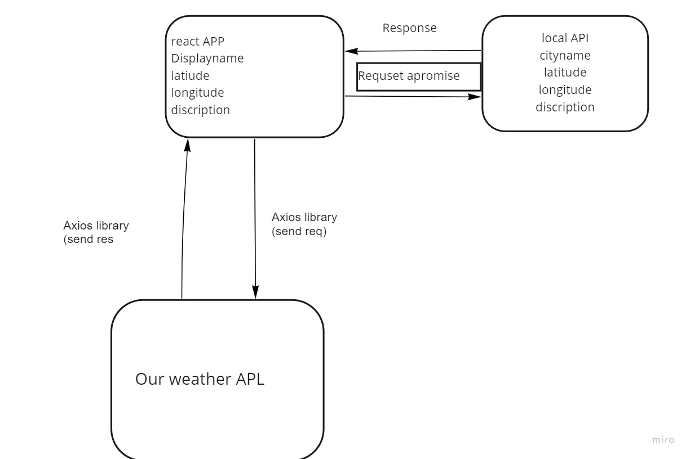

# Author: DinaAlshboul

## Version: 1.0.0

## Overview

It is a custom API contains the data for three cities and their crossponding weather conditions retrieved from specific data.

## Getting Started

install the dependencies
make routes
Initialize response functions
Architecture

## Architecture

## Change Log
29-08-2022 12:1am - Application now isn't complete.

## Credit and Collaborations
 
Abeer Alshboul is my  partner. We designed the WorkFlow of data.

## Time Estimates

Name of feature : Express Server/API

Estimate of time needed to complete : 6 hours

Start time : 3:30pm

Finish time : 12:00am

Actual time needed to complete : 8,30 hours